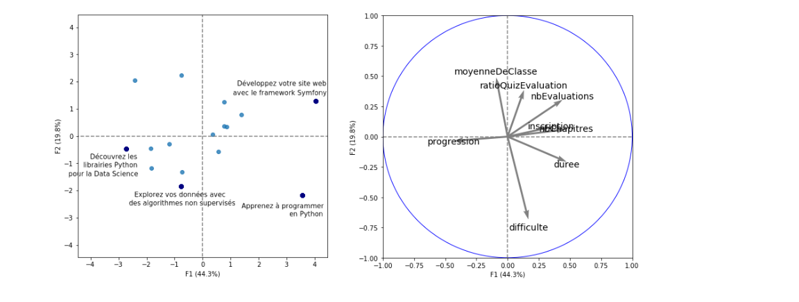

## Individus et plan factoriel

Nous allons projetter le nuage des individus $N_I$ sur le premier plan factoriel et l'interpréter en parallèle du cercle des corrélations.

Le cercle des corrélations nous indiquent quelles variables sont corrélées ou anti-corrélées à F1 et à F2.

Pour interpréter notre projection , on se demande qu'est ce qui différencie les points qui ont une petite abscisse de ceux qui en ont une grande et respectivement pour les ordonnées.

### Analyse de **F1**
On peut se poser des question comme : qu'est ce qui différencie le cours 1 `Développer votre site web avec le framework symfony` du cours 2 `Découvrer les librairies python pour la Data Science`

F1 est fortement corrélée avec aux variables durée, nombre de chapitres et nombre d’évaluations alors il y a de grande chance pour que les individus avec une grande absisse ont de grandes valeurs pour F1.
Ainsi se deplacer dans le sens croissant des absisses peut être assimilé à passer des cours du moins au plus long.

**note** : Ce n'est pas toujours vrai pour les individus pris séparement et les individus mal représentés.

Se deplacer dans le sens décroissant des absisses veut dire alors aller vers les cours avec de grandes valeurs pour la variable progression.

### Analyse de **F2**
On peut se demander :

- Qu'est ce qui différencie deux cours avec des absisses proches mais des ordonnées très différentes ?

- Qu'est ce qui différencie deux cours qui ont des ordonnées très différentes ?

On sait que F2 est fortement corrélée à la moyenne et anticorrélée à la difficulté donc en l'interpretant comme la facilité du cours on pourrait dire que les points avec une faible ordonnée comme le cours 3 `Explorez vos données avec des algorithmes non supervisée` et le cours 4 `Apprenez à programmer en Python` sont des cours définis avec un niveau de difficulté élevé

**note** : Pour le cours 4 , on peut dire que c'est un cours assez long et une difficulté attribué comme élevée.

En représentant le deuxieme plan factoriel F3+F4 , on se demandera ce que traduit :

- Deux individus avec des composantes assez similaires pour F1 et F2 mais très différentes pour F3

- A part la difficulté et la longueur des individus avec des valeurs très différentes pour F3

## Qualité de la représentation et contributions
Ici il s'agit de proximité avec le plan factoriel c'est à dire un individu bien representée est proche du plan et inversement.

Deux individus proches dans l'espace $\mathbb{R}^p$ sont similaires et inversement.

**note** : Il s'agit toujours d'une projection qui n'est pertinente que si les individus sont tous les deux bien representés.
