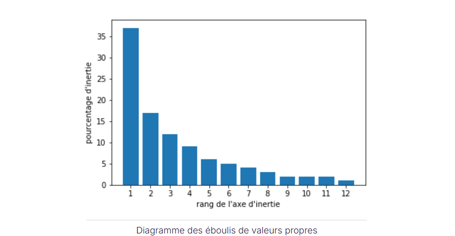
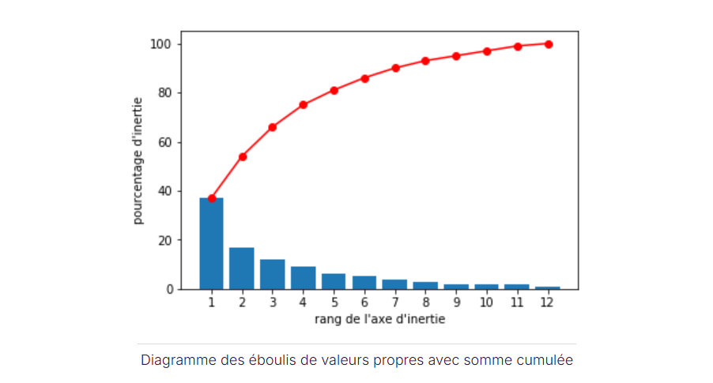

# Combien d'axes d'inertie peut-on trouver ?

Dans un espace à p dimensions on ne peut trouver que p axes orthogonaux au maximum.

Pour décrire parfaitement n individus on a besoin au maximum de n-1 axes

**Conclusion** : Le nombre maximal de composante dans une ACP sera le minimum entre n-1 et p

**note** : On n'analysera rarement l'ensemble des composantes.

# Combien de composantes analyser ?

L'éboulis des valeurs propres est un diagramme qui décrit le pourcentage d'inertie totale associé à chaque axe.

**note** : valeur propre parceque les inerties portées par chaque axe $u_s$ sont égales aux valeurs propres $\lambda_s$ de la matrice de covariance des données.

On peut également afficher la somme cumulée des inerties .

# Comment interpréter ces pourcentages d'inertie ?

Les pourcentages d'inertie nous donnent une information sur la structure de nos données.
Examinons deux cas extrêmes : 

- Cas 1 : Les variables sont indépendantes et l'inertie totale est équitablement répartie entre les axes (100/p pour chaque axe)

- Cas 2 : Toutes les variables sont corrélées deux à deux avec un coefficient de corrélation de 1 . Un seul axe suffit pour capter 100% d'inertie totale.

# Combien de composantes analyser ?
Tout dépend des objectifs et du contexte . 
On a tendence à negliger les axes dont l'inertie associée est inférieure à (100/p)% . Il s'agit du `critère de Kaiser`

**note** : (100/p)% est celle obtenue quand les variables sont indépendantes deux à deux.

On a ensuite `la méthode du coude` : qui consiste à repérer l'endroit à partir duquel le pourcentage d'inertie diminue beaucoup plus lentement lorsque l'on parcourt le diagramme des éboulis de gauche à droite.

**note** : en pratique on  a tendance à s'arrêter dès que l'on n'arrive plus à interpréter les axes principaux d'inertie.
Il est fréquent de n'analyser que le premier , les 2 premiers ou les 3 premiers plans factoriels.

